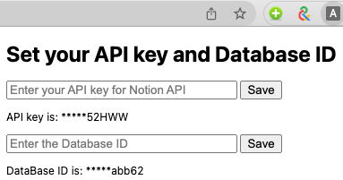
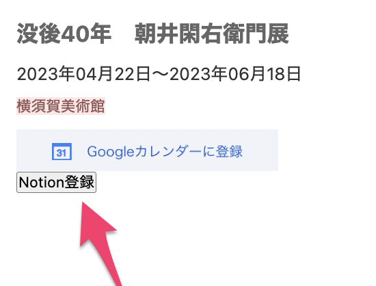

## ArtScapeToNotion
- 美術展情報サイト artscape (https://artscape.jp/) の展覧会情報を Notion のデータベースに登録するChrome の拡張機能です。
- 登録した展覧会情報をNotionでタイムライン表示することができます。

## DEMO
- 追加予定

## How to Use 
1. このレポジトリをクローンする。(拡張機能ストアでの公開予定)
1. Chrome の拡張機能に登録する。([Ref](https://support.google.com/chrome/a/answer/2714278?hl=ja))
1. @kootr 作成の[データベースのテンプレート](https://sudsy-birthday-2d0.notion.site/335ae1f69f0c4a9888f7da44927617e5?v=b9fc171fd0f94f4b9d6f9cf215747516)を自分のNotionページに複製する。
1. 拡張機能のアイコンをクリックして、NotionのAPI keyとDatabase ID を登録する。 

    1. Notionの API keyの取得方法: 追記予定　（Notion公式ページにあります）
    1. Database ID の取得方法: 追記予定（Notion公式ページにあります）
1. Chrome ブラウザで artscape の展覧会情報ページ(https://artscape.jp/exhibition/schedule/ 以下)にアクセスする。
1. 登録したい展覧会の「Notion登録」 ボタンをクリックする。

## 注意
- テンプレートからコピーしたNotionデータベースの列情報を変更すると正常に動作しない可能性があります。
- artscape (https://artscape.jp/) のリニューアルなどによりページ構造が変更されると動作しなくなる可能性があります。