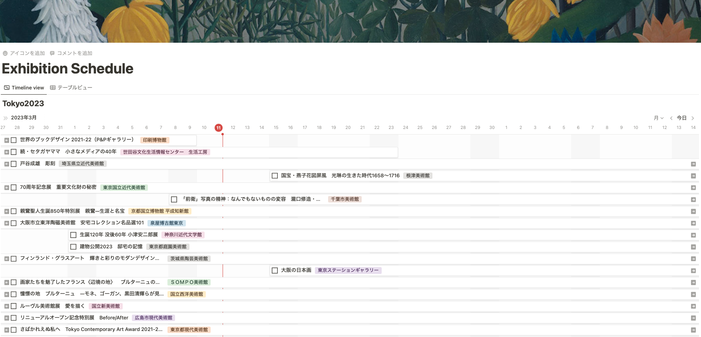

## ArtScapeToNotion
- 美術展情報サイト artscape (https://artscape.jp/) の展覧会情報を Notion のデータベースに登録するChrome の拡張機能です。
- 登録した展覧会情報をタイムライン表示することで会期などの情報をわかりやすく可視化できます。

## DEMO
- 追加予定

## How to Use
1. このレポジトリをクローンする。
1. Chrome の拡張機能に登録する。([Ref](https://support.google.com/chrome/a/answer/2714278?hl=ja))
1. テンプレートのデータベースを複製する。：　追記予定
1. 拡張機能のアイコンをクリックしてNOTIONのTOKEN情報と、Database ID を登録する。 
    1. TOKEN情報の取得: 追記予定
    1. Database ID の取得: 追記予定
1. artscape (https://artscape.jp/) の展覧会情報ページにアクセスする。
1. Notionに登録したい展覧会の「Notion登録」 ボタンをクリックする。

## 注意
- Notionデータベースの列情報を変更すると動作しなくなる可能性があります。
- artscape (https://artscape.jp/)  のHTML構造が変更されると動作しなくなる可能性があります。