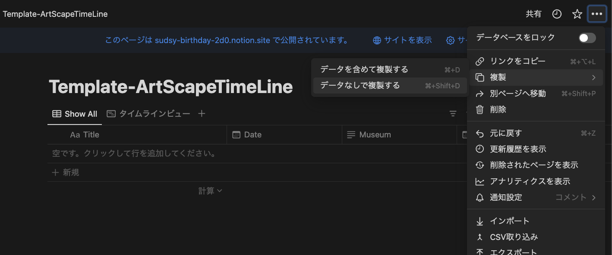
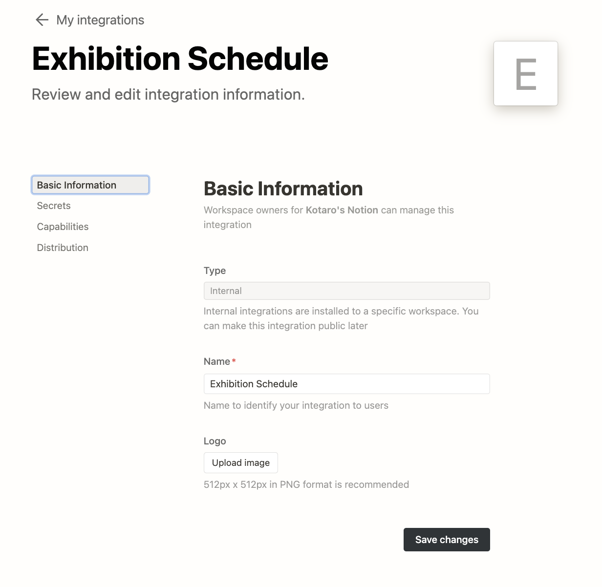
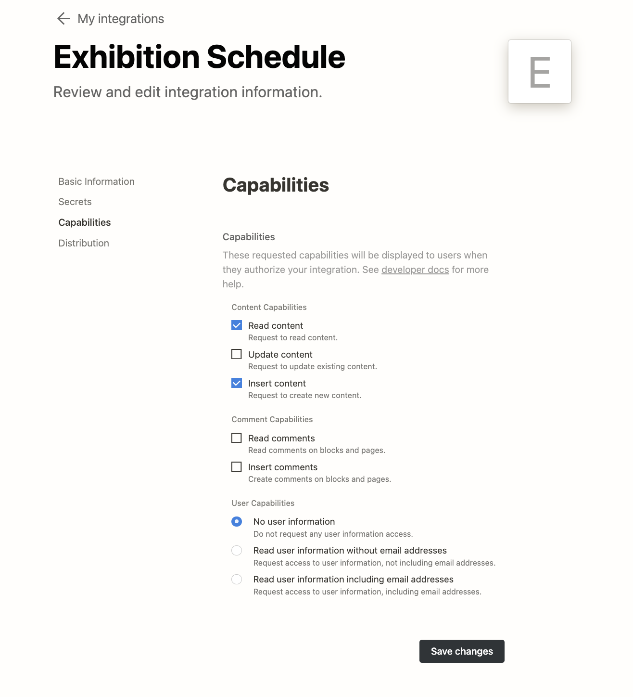
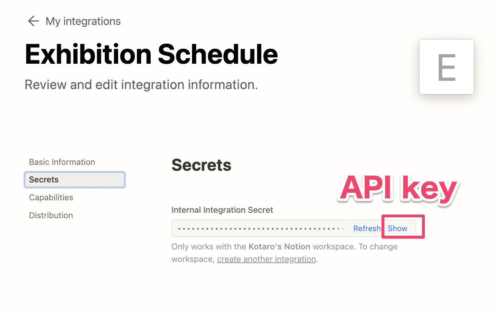
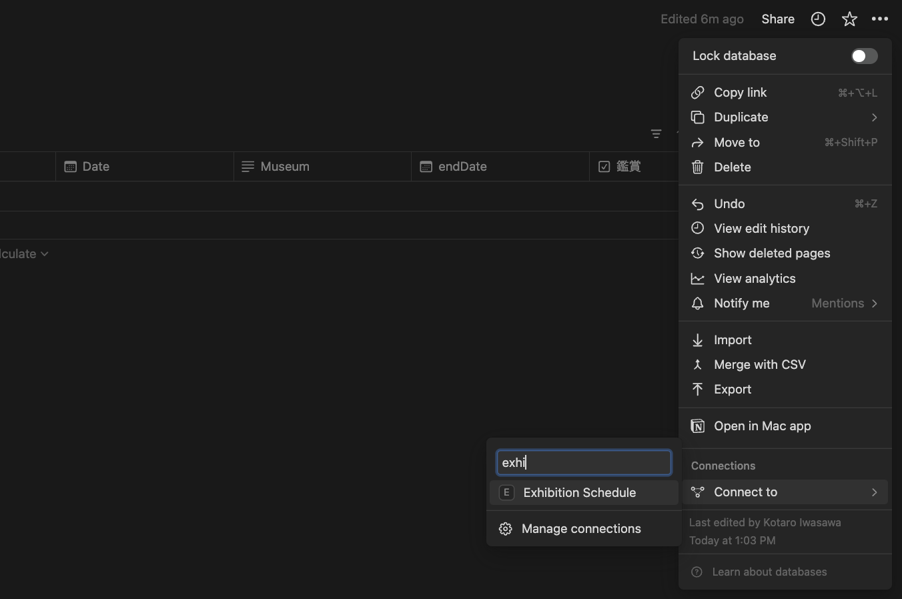
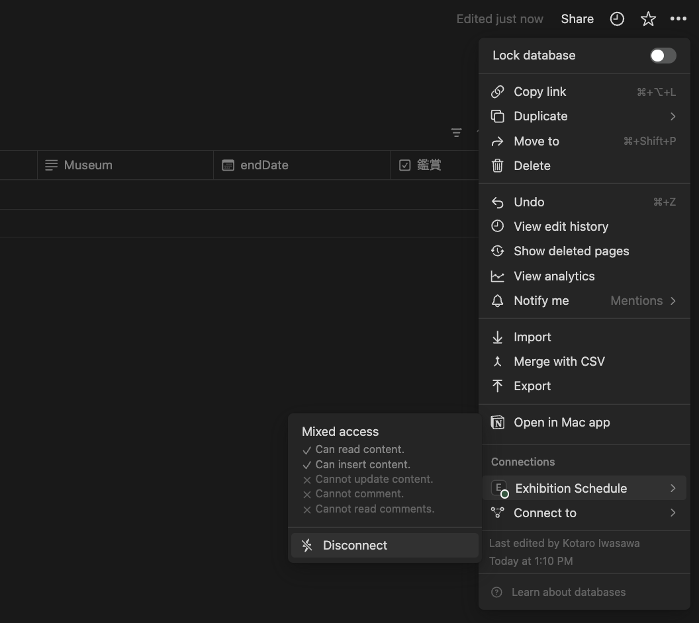
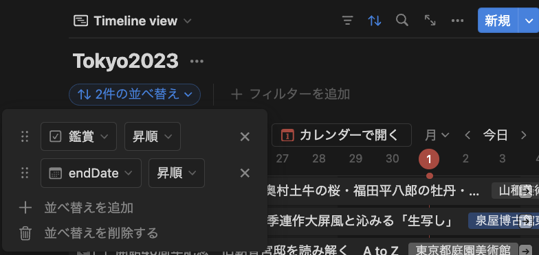

## ArtScapeToNotion
- 美術展情報サイト artscape (https://artscape.jp/) の展覧会情報を Notion のデータベースに登録するChrome の拡張機能です。
- 登録した展覧会情報をNotionでタイムライン表示することができます。

## DEMO
- 追加予定

## How to Use 
1. このレポジトリをクローンする。(拡張機能ストアでの公開予定)
1. Chrome の拡張機能に登録する。([Ref](https://support.google.com/chrome/a/answer/2714278?hl=ja))
1. @kootr 作成の[データベースのテンプレート](https://kootr.notion.site/83084a288bd14d8192a68273863ee110?v=3de43fd198444b7d89c4591baf2b6e4a&pvs=4)を自分のNotionページに複製する。

1. 内部インテグレーションの作成
    https://www.notion.so/my-integrations から作成できます。権限の設定などは以下の通り。
    
    
    
1. データベースへの紐付け
複製したデータベースに内部インテグレーションをconnectします
    
    
1. Database ID の取得　データベースのURLは以下のようになっており、URLの一部の32桁の文字列をコピーします。`https://www.notion.so/[ドメイン名]/[DATABASE ID(32桁の文字列)]?v=[VIEW ID] `
1. 拡張機能のアイコンをクリックして、Notionの内部インテグレーションのAPI keyと上でコピーしたデータベースのDatabase ID を登録する。 （内部インテグレーションの作成は少し難しいかもしれませんが、以下で分からなければ手順を紹介しているブログなど色々ありますのでそちらを参考に設定してください）
1. 拡張機能を有効にしたChrome ブラウザで artscape の展覧会情報ページ(https://artscape.jp/exhibition/schedule/ 以下)にアクセスする。
1. 登録したい展覧会の「Notion登録」 ボタンをクリックする。

## 補足
- 並び替え順序を以下のように設定するとタイムラインがより見やすくなります。

## 注意
- テンプレートからコピーしたNotionデータベースの列情報を変更すると正常に動作しなくなる可能性があります。
- artscape (https://artscape.jp/) のリニューアルなどによりページ構造が変更されると動作しなくなる可能性があります。